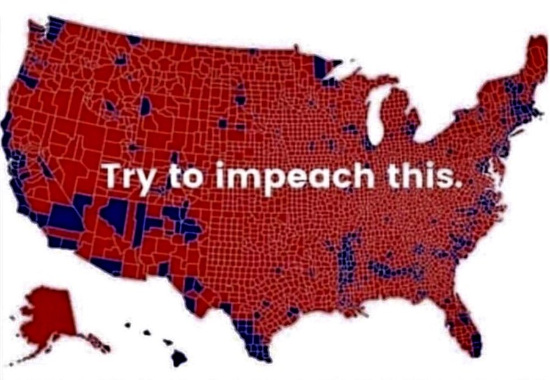
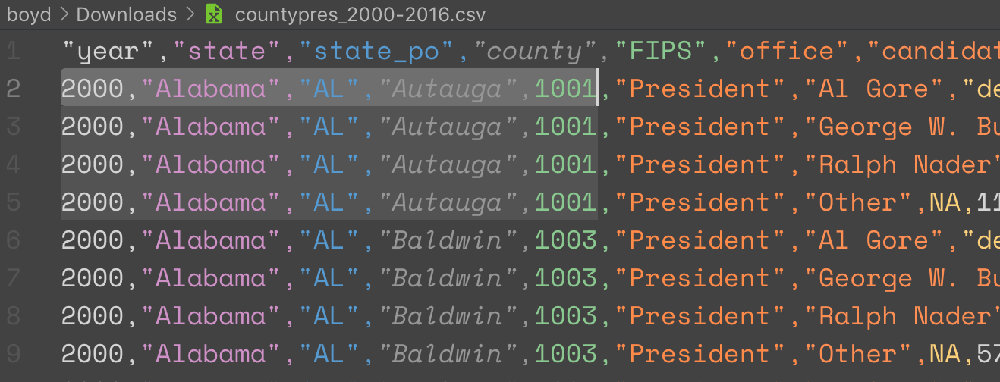

# Regular Expressions to the Rescue

## TL;DR

```txt
(",)([0-9]{4},")
$10$2
```
*Example solution to add leading zeros to improperly encoded FIPS codes*

## Preamble

We live in unsteady times. Voices online weaponize maps to mislead casual viewers. Regardless of your political viewpoint, the recently published map below is a fail on a few critical levels.

    
*Map suggests most people voted red in the 2016 election*

As we know, population is not uniformly spread across the country. The two most populated counties in New York state have more people than the entire state of Kentucky. Those NY counties are miniscule compared to the swath of KY counties at this scale; so, we have a comparison problem. Second, we don't know how close these red vs. blue vote tallies were. What if the red counties won by just one vote? What if the blue counties won by a landslide? 

This is a classic Cartography 101 problem. Let's get some raw totals and normalize them for comparison. Any earnest mapper would jump online, search for a dataset, and start working. However, unforeseen obstacles can derail the best intentions. One of the most common problems mappers find is improperly encoded data, especially with FIPS codes used to join tabular data to spatial layers for mapping. 

FIPS codes are sequences of numbers that uniquely identify units of geography. Counties use a 5-digit string, two digits for the state and three digits for county. For example, Autauga County, Alabama is `01001`. Unfortunately, that leading zero can easily be stripped away if care isn't taken to preserve the sequence as a string value, not a number.

Stripping happens. When searching for data to map election results, the prestigious [MIT Election and Science Lab](https://electionlab.mit.edu/data) had such a malformed dataset. The below example highlights the problem.

   
*Leading zero stripped from FIPS code (as viewed in VS Code as a CSV)*

Without a correct FIPS code, this dataset is difficult to visualize. While there are many ways to add the leading zero, let's try to fix it in the code editor programmatically. That is, don't *type* hundreds of zeros, but identify a faulty pattern and repair the bad parts.

## Tools & data
We're using [VS Code](https://code.visualstudio.com/download) for a code editor, though most code editors support regular expressions. For mapping, we ❤️[QGIS](https://qgis.org/en/site/forusers/download.html) 3.8. 

Download the [County Presidential Election Returns 2000-2016](https://dataverse.harvard.edu/dataset.xhtml?persistentId=doi:10.7910/DVN/VOQCHQ) as a CSV file.

## Regular Expressions
Have you ever used a Find & Replace in a text or document editor? We hear, "Of course!" For example, find all strings that spell "pizza" and replace with "tofu" for that last minute change to the pool party invitation. Well, that is simple *regex*, or regular expression.

You might be familiar with the wildcard character `*` in searching for files in Windows Explorer or macOS Finder. That character matches any character one or more times. For example, if you wanted to select all JPEGs in a folder you might search for `*.jpg`. 

Most often, regular expressions are used to find string patterns in a text file. If you wanted to find all JPEGs that occupied a single line in a text file, the same search requires more specific notation.

```regex
^.*\.jpg$
```

The `^` says the string must start at the beginning of the line. The `.*` sequence matches any character one or more times. A `.` matches any single character so the `\.jpg` escapes the special meaning of the `.` character to literally mean `.jpg`. The `$` character matches the end of the line. 

Confusing? Of course it is! Check out some examples on [regular expressions in Visual Studio](https://docs.microsoft.com/en-us/visualstudio/ide/using-regular-expressions-in-visual-studio?view=vs-2019).


