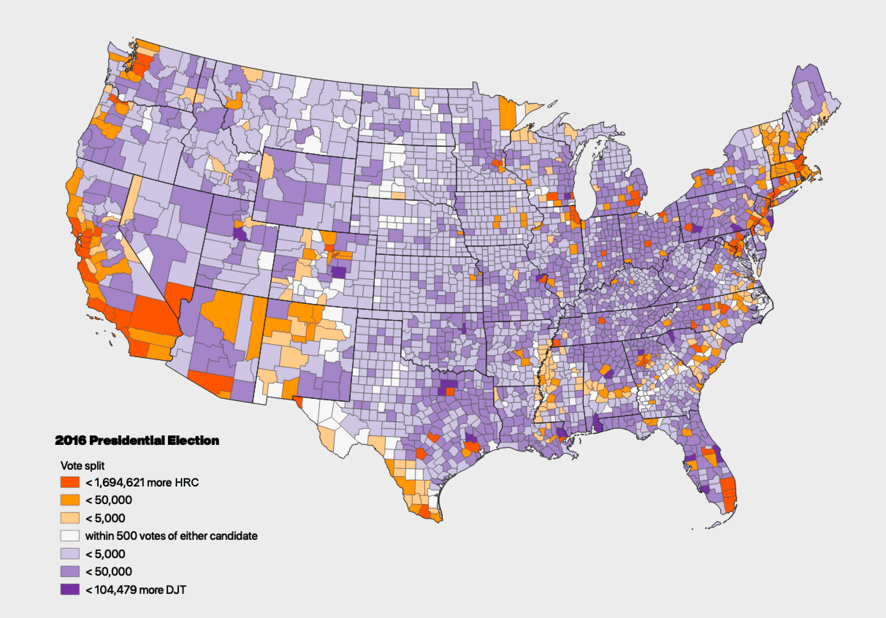

# Regular Expressions to the Rescue

<!-- TOC -->

- [Regular Expressions to the Rescue](#regular-expressions-to-the-rescue)
    - [TL;DR](#tldr)
    - [Preamble](#preamble)
        - [The potential problem with FIPS codes](#the-potential-problem-with-fips-codes)
    - [Tools & data](#tools--data)
        - [Downloads](#downloads)
    - [Regular Expressions](#regular-expressions)
        - [Finding four-digit number sequences](#finding-four-digit-number-sequences)
        - [Subexpressions and replacement variables](#subexpressions-and-replacement-variables)
    - [Mapping 2016 election returns by county](#mapping-2016-election-returns-by-county)
        - [Visualizing results](#visualizing-results)

<!-- /TOC -->

## Location and time

[Map to Miller Hall](https://maptimelex.github.io/location/) | Thursday, October 10, 6 PM Lexington, KY

## TL;DR

```txt
Regex search string
(",)([0-9]{4},")
-----
Regex replacement string
$10$2
```
*Example solution to add leading zeros to improperly encoded FIPS codes*

## Preamble

We live in unsteady times. Voices online promote misleading maps intended to manipulate a causual viewer's opinion. Regardless of your political viewpoint, the recently published map below is a fail on a few critical levels.

    
*Map suggests most people voted red in the 2016 election*

As we know, county population is not uniformly spread across the country. The two most populated counties in New York state have more people than the entire state of Kentucky. Those NY counties are minuscule compared to the swath of KY counties at this scale; so, we have a comparison problem. Second, we don't know how close these red vs. blue vote tallies were. What if the red counties won by just one vote? What if the blue counties won by a landslide? 

This is a classic Cartography 101 problem. Let's get some raw totals and normalize them for comparison. Any earnest mapper would jump online, search for a dataset, and start working. However, unforeseen obstacles can derail the best intentions. One of the most common problems mappers find is improperly encoded data, especially with FIPS codes used to join tabular data to spatial layers for mapping. 

### The potential problem with FIPS codes

FIPS codes are sequences of numbers that uniquely identify units of geography. Counties use a 5-digit string, two digits for a state, and three digits for a county. For example, Autauga County, Alabama is `01001`. Unfortunately, that leading zero can easily be stripped away if care isn't taken to preserve the sequence as a string value, not a number.

Stripping happens. When searching for data to map election results, the prestigious [MIT Election and Science Lab](https://electionlab.mit.edu/data) had such a malformed dataset. The below example highlights the problem.

   
*Leading zero stripped from FIPS code (as viewed in VS Code as a CSV)*

Without a correct FIPS code, this dataset is difficult to visualize. While there are many ways to add the leading zero, let's try to fix it in the code editor programmatically. That is, don't *type* hundreds of zeros, but identify a faulty pattern and repair the bad parts.

## Tools & data
We're using [VS Code](https://code.visualstudio.com/download) for a code editor, though most code editors support regular expressions. For mapping, we ❤️[QGIS](https://qgis.org/en/site/forusers/download.html) 3.8. 

### Downloads

* The [County Presidential Election Returns 2000-2016](https://dataverse.harvard.edu/dataset.xhtml?persistentId=doi:10.7910/DVN/VOQCHQ) as a CSV file.
* Cartographic boundary files for 2016 counties, [1:5M scale](https://www2.census.gov/geo/tiger/GENZ2016/shp/cb_2016_us_county_5m.zip) as a zipped Shapefile.

## Regular Expressions
Have you ever used a Find & Replace in a text or document editor? We hear, "Of course!" For example, find all strings that spell "pizza" and replace it with "tofu" for that last-minute change to the pool party invitation. Well, that is simple *regex*, or regular expression.

You might be familiar with the wildcard character `*` in searching for files in Windows Explorer or macOS Finder. That character matches any character one or more times. For example, if you wanted to select all JPEGs in a folder, you might search for `*.jpg`. 

Most often, regular expressions are used to find string patterns in a text file. If you wanted to find all JPEGs that occupied a single line in a text file, the same search requires more specific notation.

```regex
^.*\.jpg$
```

The `^` says the string must start at the beginning of the line. The `.*` sequence matches any character one or more times. A `.` matches any single character, so the `\.jpg` escapes the special meaning of the `.` character to mean `.jpg` literally. The `$` character matches the end of the line. 

Confusing? Of course it is! Check out some examples on [regular expressions in Visual Studio](https://docs.microsoft.com/en-us/visualstudio/ide/using-regular-expressions-in-visual-studio?view=vs-2019). Play with examples in the download CSV file and see if you can predictably select various string sequence. 

### Finding four-digit number sequences

In our example, we have a pattern where four digits are surrounded by double-quotes. In fact, the second quote is followed by "P" because this file counts presidential returns. So, a simple pattern would be:

```
",1001,"P
```

We know, of course, the four digits change. We need to identify a regex pattern that can identify only a four-digit sequence. Using square brackets, the pattern `[1-9]` would match any number of digits between 1 and 9. Now, we need to limit the length of the sequence to four digits. Using curly brackets, we can limit the length to any number of occurrences. In our case, we want `{4}`. So the regex pattern would be:

```
",[1-9]{4},"
```

The `"` and `,` are not special characters in our regex, so they are interpreted as typed. Other characters are special and, depending of the flavor of regex you are using, slightly different characters and syntax are used. We are using VS Code, which uses the [.NET regex engine](https://docs.microsoft.com/en-us/dotnet/standard/base-types/regular-expression-language-quick-reference).

### Subexpressions and replacement variables

While it is important to select desired strings, the challenge is surgically replacing the string with the correct characters. Let's present grouping subexpressions.

Goal. We need to put the zero between the first `,` and digit. If we applied the following as the replacement string, we would get literally what is typed.

```
",0[1-9]{4},"
```

Nice try and seems plausible! Replacement strings do not, by default, implement regex expressions. Instead, we should group the search pattern with subexpressions that expose the area we need to modify. The grouping pattern uses round brackets `()` to isolate a subexpression. Each group then is assigned a numeric label, starting with the number 1, and ascending in value left to right for each group. The first group:


```
(",)
```

And the second group:

```
([1-9]{4},")
```

Together, the search string is:

```
(",)([1-9]{4},")
```

To access these groups in the replacement string, use the grouping number label proceeded by a `$` character. The below replacement string would change nothing.

```
$1$2
```

The last addition to the replacement string is to insert the number `0` between the groups.

```
$10$2
```

Now, you should have properly formatted FIPS code in your CSV! Let's map!

## Mapping 2016 election returns by county

The first order of business is filtering and preparing the CSV data in QGIS. Add the layers to Q making sure to import the CSV **without allowing QGIS automatically detecting field types**. We'll undo everything! The easiest way to accomplish this is to drag and drop the CSV from your OS file system to QGIS Map Canvas.

Open the **DB Manager** and select the CSV layer from the **Virtual Layers > Project Layers**. Add the following query to export the vote totals for the democratic candidate in 2016.

```sql
select 
    FIPS,
    state,
    county,
    cast(candidatevotes as number) as hrc_votes
from 
    "countypres_2000-2016" 
where 
    "party" = 'democrat' and "year" = '2016'
```

After a successful query, load the layer into the Q Map Canvas. 

   
*Load query to Map Canvas*

Repeat the query for the republican candidate and load it into the Q Map Canvas. 

```sql
select 
    FIPS,
    cast(candidatevotes as number) as djt_votes,
    cast(totalvotes as number) as total_votes
from 
    "countypres_2000-2016" 
where 
    "party" = 'republican' and "year" = '2016'
```

Let's join these tables to the county polygon layer. Double-click the county layer and use the **Layer Properties > Joins** to complete the join. Use the *FIPS* field in both query tables and the *GEOID* in the county polygon layer as the keys in the join. You'll need to apply two joins, on for each query table.

    
*Tabular join in QGIS*

To complete the join (and make it permanent), export the layer to either a GeoJSON or GeoPackage.

### Visualizing results

Let's map raw vote counts by county, and then normalize by county area.

   
*Vote total by county*

   
*Vote total per square mile by county*

Now, map the difference of vote totals for the major candidates. Orange color indicates the Hillary Rodham Clinton had larger vote totals in the county; purple color indicates the Donald J Trump received more votes.

   
*Vote split for major candidates by county*


   
*Vote percent split for major candidates by county*

QGIS has a *2.5 Symbology* method that can extrude polygon features based on an attribute. In the final example, we map relative vote totals by county.

   
*Relative votes by party*

Thank you for the adventure!


